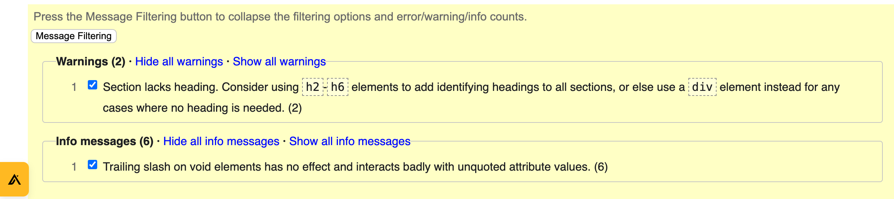
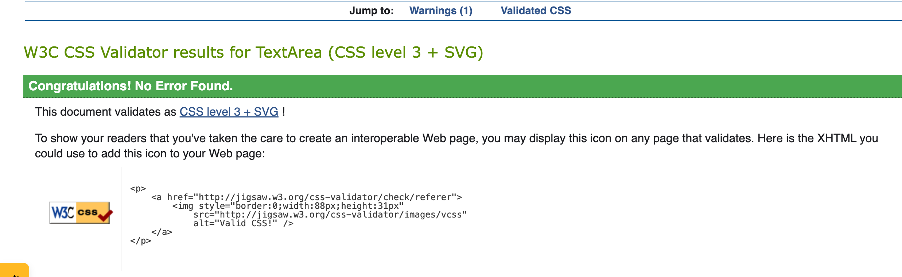
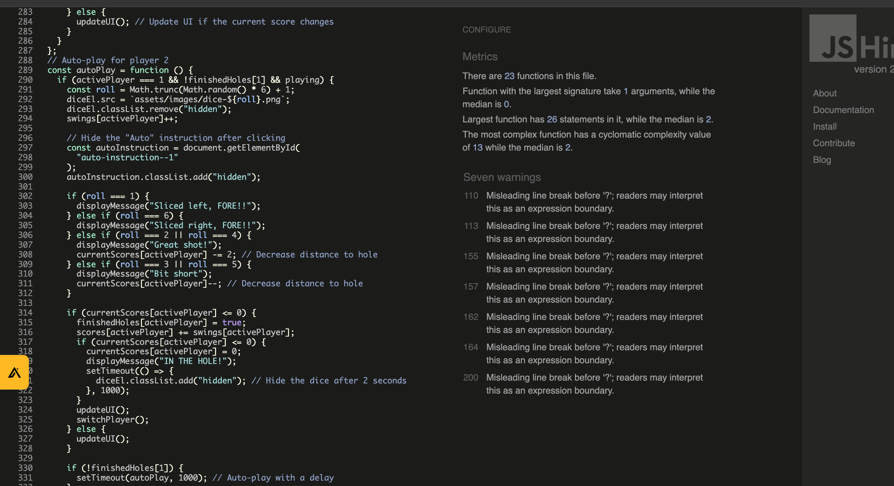
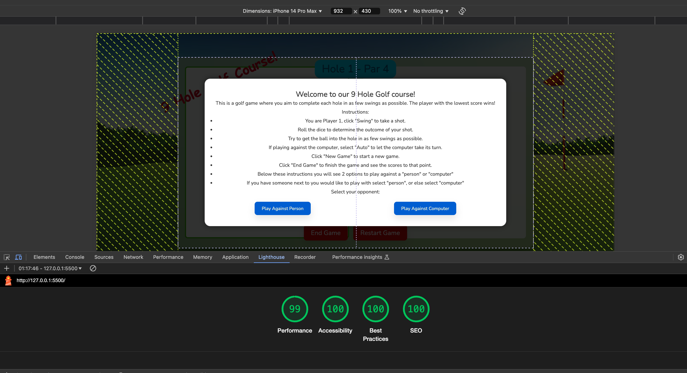
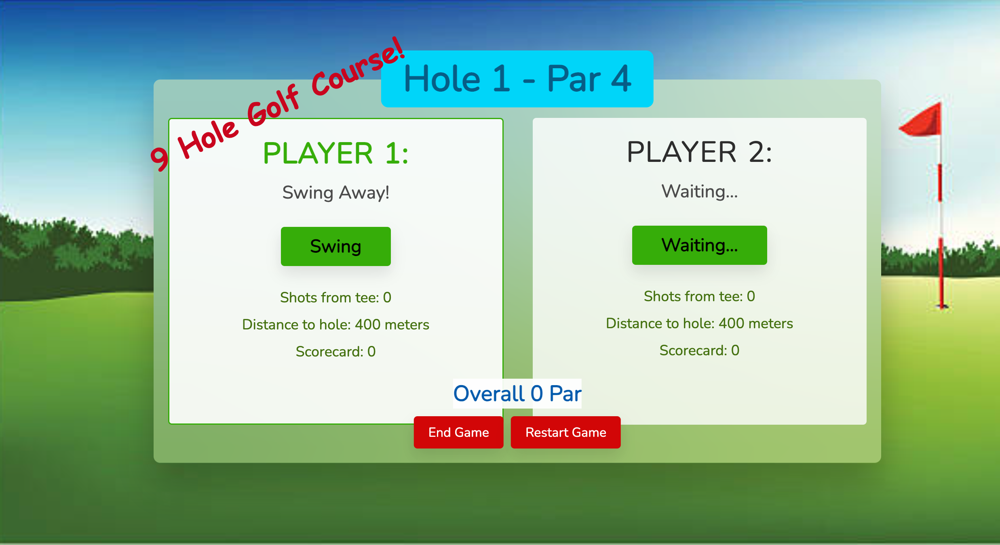
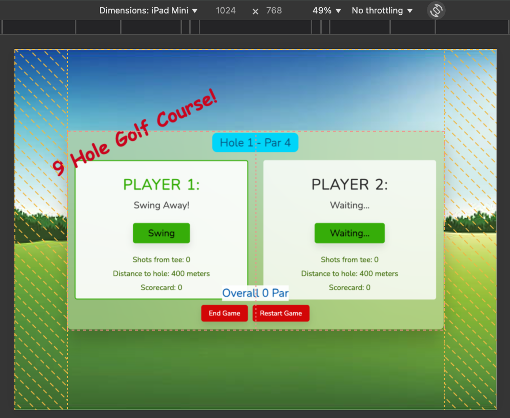
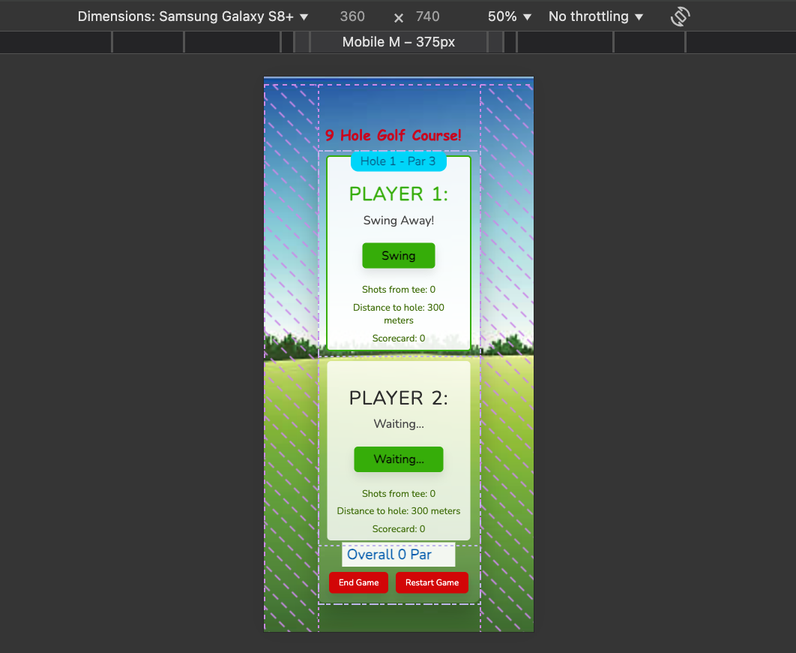

# Golf Game

## Table of Contents

- [Overview](#overview)
- [Game Rules](#game-rules)
- [Features](#features)
- [User Experience (UX)](#user-experience-ux)
  - [User Goals](#user-goals)
  - [User Stories](#user-stories)
- [Design](#design)
  - [Colour Scheme](#colour-scheme)
  - [Typography](#typography)
  - [Imagery](#imagery)
- [Wireframes](#wireframes)
- [Features](#features)
- [Technologies Used](#technologies-used)
  - [Languages](#languages)
  - [Frameworks, Libraries, and Programs](#frameworks-libraries-and-programs)
- [Testing](#testing)
  - [Code Validation](#code-validation)
  - [Performance Testing](#performance-testing)
  - [Responsiveness Testing](#responsiveness-testing)
  - [User Stories Testing](#user-stories-testing)
- [Bugs and Fixes](#bugs-and-fixes)
- [Deployment](#deployment)
- [Credits](#credits)
- [License](#license)

---

## Overview

The **Golf Game** is an interactive two-player golf simulation game. It allows users to compete either against another player or a computer (in auto mode). Players aim to complete each hole in as few swings as possible. Swings are judged based on chance and dictated by the roll of the dice. The game tracks scores across multiple holes, calculating performance based on par values for each hole. It can be stopped at any time, and scores are evaluated, so users do not need the time for a full 9 holes. This game might be used as an easy and quick way to pass free time with a friend or by yourself. It is targeted at people of all ages and just for passing fun. We do not yet store data for leaderboards or ongoing competitions. 

Live site: <a href="https://dickiegog.github.io/PP2-2/" target="_blank" rel="noopener noreferrer">Golf Game</a>.

## Game Rules

- The game consists of multiple holes, each with its own par score, which represents the expected number of swings to complete the hole.
- Players take turns hitting the golf ball toward the hole.
- Players can choose to manually swing or enable an "Auto" mode for the second player, simulating play against a computer.
- The player with the fewest swings wins each hole.
- After both players finish a hole, the par score of that hole is added to their overall score.
- The game ends after completing all the holes, and the player with the lowest overall score wins.

---

## Features

### Existing Features

- **Player Turns**: Players take turns swinging at the ball until the hole is completed.
- **Manual and Auto Modes**: Player 2 can be controlled manually or switched to auto mode for computer simulation.
- **Dynamic Score Tracking**: Scores and par values are calculated dynamically for each player.
- **Game End Logic**: The game determines and displays the winner at the end of all holes.

### Future Features

- **Leaderboard**: Store player scores locally for leaderboard functionality.
- **Customizable Holes**: Allow players to set par values for holes.

---

## User Experience (UX)

### User Goals

- Enjoy a casual, interactive golf simulation game.
- Compete against another player or the computer.
- View real-time score updates and game feedback.

### User Stories

- _As a user_, I want to play an engaging golf game on my browser.
- _As a user_, I want to see instructions that help me understand how to play.
- _As a user_, I want the game to be responsive across devices.

---

## Design

### Colour Scheme

- Background: Display green at the bottom and blue at the top of the screen (to mimic a golf course on a nice day).
- Buttons: Contrasting colours (blue, green, red) for clarity and interaction feedback.

### Typography

- Primary Font: **Nunito** (Sans-serif for clean, modern readability).

### Imagery

- Background: Golf course-themed image.
- Icons: Dice icons for visual feedback during play.

---

## Wireframes

Wireframes were not provided, but the game was designed to prioritize clarity and accessibility for all users.

---

## Technologies Used

### Languages

- HTML
- CSS
- JavaScript

### Frameworks, Libraries, and Programs

- **<a href="https://fontawesome.com/" target="_blank">FontAwesome</a>**: For icons.
- **<a href="https://fonts.google.com/" target="_blank">Google Fonts</a>**: For typography.
- **<a href="https://jshint.com/" target="_blank">JSHint</a>**: For JavaScript code validation.

---

## Testing

### Code Validation

- **HTML Validation**: Passed with no errors. See screenshot:  
  

- **CSS Validation**: Passed with no errors. See screenshot:  
  

- **JavaScript Validation**: Passed with minor warnings:
  - Misleading line breaks in conditional statements (e.g., ternary operators).
  - These warnings do not affect functionality but were noted for potential future refactoring.  
  

### Performance Testing

- **Lighthouse**:  
  Performance scores are excellent across categories. See lighthouse testing results:  
  

### Responsiveness Testing

The game is fully responsive on multiple screen sizes, with the layout adjusting to display vertically for better UX:

- Desktop:  
  

- Tablet:  
  

- Mobile:  
  

### User Stories Testing

- **Play Against a Friend**: Successfully implemented through manual turn-taking.
- **Play Against the Computer**: Successfully implemented with auto-play for Player 2.
- **View Game Instructions**: Instructions displayed correctly on page load.

---

## Bugs and Fixes

- **Warnings**: Misleading line breaks flagged by JSHint.
  **Fix**: Not resolved in this version as functionality is unaffected but will be refactored in future updates.
- **Bugs**: Links from this README are not opening in new tab.
  **Fix**: Not resolved, despite adding target="_blank" and rel="noopener noreferrer" to anchored links, they continue to open in the same tab.
  
- **Previous Issues**: There was a lack of clarity for users pressing the Auto button to start the computer’s automatic turn.
  **Fix**: Added an extra line in the intro instructions and an extra line above the "Auto" button to explain.

---

## Deployment

To deploy the Golf Game:

1. Clone the repository: <a href="https://github.com/dickiegog/PP2-2" target="_blank">Golf Game Repository</a>.
2. Navigate to your GitHub repo.
3. Go to **Settings** > **Pages**.
4. Under **Source**, select "Deploy from Branch."
5. Choose the **main** branch and root folder.
6. Save, and GitHub Pages will generate a live link.

The live link can be found here - https://dickiegog.github.io/PP2-2/ 

---

## Credits

### Images

- **Background**: <a href="https://www.istockphoto.com/vector/golf-field-with-flag-gm165594199-6744168?phrase=golf+backgrounds" target="_blank">iStock Golf Course</a>
- **Icons**: <a href="https://www.freepik.com/icons/golf" target="_blank">Freepik Golf Icon</a>

### Acknowledgements

- This project was built using the [Code Institute Full Template](https://github.com/Code-Institute-Org/ci-full-template), which provided the foundation for setting up and deploying the project.
- Code Institute for providing the <a href="https://github.com/Code-Institute-Solutions/readme-template" target="_blank">README template</a>.
- <a href="https://jshint.com/" target="_blank">JSHint</a> for JavaScript validation.
- <a href="https://fonts.google.com/" target="_blank">Google Fonts</a> for typography.

---

## License

This project is licensed under the MIT License. 